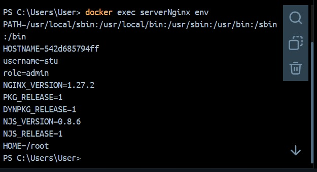
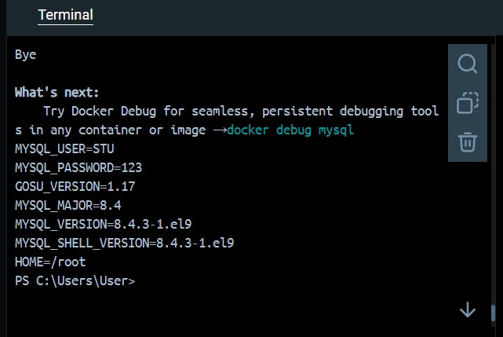

# Variables de Entorno
### ¿Qué son las variables de entorno
````
las variables de entorno son utilizadas para definir valores que se encuentren disponibles para procesos que se ejecutan
dentro del contenedor y para configurar el comportamiento de las aplicaciones que corren dentro de un contenedor Docker
````
# COMPLETAR

### Para crear un contenedor con variables de entorno?

```
docker run -d --name <nombre contenedor> -e <nombre variable1>=<valor1> -e <nombre variable2>=<valor2>
```

### Crear un contenedor a partir de la imagen de nginx:alpine con las siguientes variables de entorno: username y role. Para la variable de entorno rol asignar el valor admin.

# COMPLETAR

# CAPTURA CON LA COMPROBACIÓN DE LA CREACIÓN DE LAS VARIABLES DE ENTORNO DEL CONTENEDOR ANTERIOR

### Crear un contenedor con mysql:8 , mapear todos los puertos
# COMPLETAR
````
PS C:\Users\User> docker run -d --name mysql -e MYSQL_ROOT_PASSWORD=123 -e MYSQL_DATABASE=baseStu -e MYSQL_USER=stu -e MYSQL_PASSWORD=123 -p 3306:3306 mysql:8
````

### ¿El contenedor se está ejecutando?
# COMPLETAR

````
en mi caso si se ejecuta
````

### Identificar el problema
# COMPLETAR

### Eliminar el contenedor creado con mysql:8 
````
PS C:\Users\User> docker stop mysql
mysql
PS C:\Users\User> docker rm mysql
mysql
````
# COMPLETAR

### Para crear un contenedor con variables de entorno especificadas
- Portabilidad: Las aplicaciones se vuelven más portátiles y pueden ser desplegadas en diferentes entornos (desarrollo, pruebas, producción) simplemente cambiando el archivo de variables de entorno.
- Centralización: Todas las configuraciones importantes se centralizan en un solo lugar, lo que facilita la gestión y auditoría de las configuraciones.
- Consistencia: Asegura que todos los miembros del equipo de desarrollo o los entornos de despliegue utilicen las mismas configuraciones.
- Evitar Exposición en el Código: Mantener variables sensibles como contraseñas, claves API, y tokens fuera del código fuente reduce el riesgo de exposición accidental a través del control de versiones.
- Control de Acceso: Los archivos de variables de entorno pueden ser gestionados con permisos específicos, limitando quién puede ver o modificar la configuración sensible.

Previo a esto es necesario crear el archivo y colocar las variables en un archivo, **.env** se ha convertido en una convención estándar, pero también es posible usar cualquier extensión como **.txt**.
```
docker run -d --name <nombre contenedor> --env-file=<nombreArchivo>.<extensión> <nombre imagen>
```
**Considerar**
Es necesario especificar la ruta absoluta del archivo si este se encuentra en una ubicación diferente a la que estás ejecutando el comando docker run.

### Crear un contenedor con mysql:8 , mapear todos los puertos y configurar las variables de entorno mediante un archivo


# COMPLETAR

**primero creamos el archivo .env**
````
PS C:\Users\User> @"
>> MYSQL_ROOT_PASSWORD=123
>> MYSQL_DATABASE=DATASTU
>> MYSQL_USER=STU
>> MYSQL_PASSWORD=123
>> "@>mysql.env
````
**luego creamos el contenedor con dicho archivo**
````
PS C:\Users\User> docker run -d --name mysql --env-file=mysql1.env -p 3306:3306 mysql:8
7ee48bd791097a9777ff6b3fec73fb246370bd6e11d95a72b899c96e0ca6e681
````


# CAPTURA CON LA COMPROBACIÓN DE LA CREACIÓN DE LAS VARIABLES DE ENTORNO DEL CONTENEDOR ANTERIOR 



### ¿Qué bases de datos existen en el contenedor creado?
# COMPLETAR
````

PS C:\Users\User> docker exec -it mysql mysql -u root -p    
Enter password: 
Welcome to the MySQL monitor.  Commands end with ; or \g.   
Your MySQL connection id is 8
Server version: 8.4.3 MySQL Community Server - GPL

Copyright (c) 2000, 2024, Oracle and/or its affiliates.     

Oracle is a registered trademark of Oracle Corporation and/or its
affiliates. Other names may be trademarks of their respective
owners.

Type 'help;' or '\h' for help. Type '\c' to clear the current input statement.


mysql> SHOW DATABASES;
+--------------------+
| Database           |
+--------------------+
| DATASTU            |
| information_schema |
| mysql              |
| performance_schema |
| sys                |
+--------------------+
5 rows in set (0.01 sec)

mysql>
````
