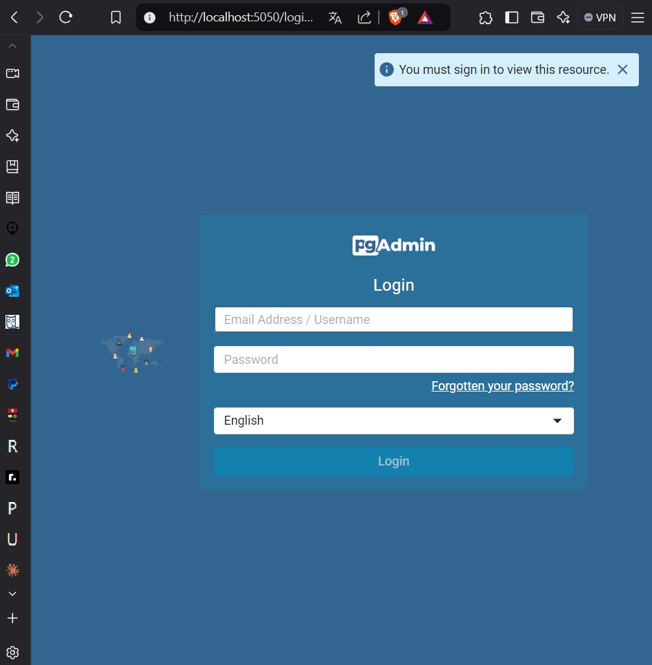
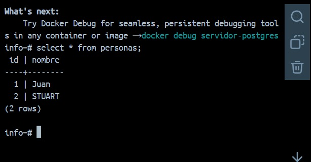

### Crear contenedor de Postgres sin que exponga los puertos. Usar la imagen: postgres:11.21-alpine3.17
# COMPLETAR
````
PS C:\Users\User> docker run -d --name servidor-postgres -e POSTGRES_USER=stu -e POSTGRES_PASSWORD=123 -e POSTGRES_DB=info postgres:11.21-alpine3.17
8fa5fccf076a4b54f80ce28c13d8e4bd41ff7ff538f9554558d1ed46dc142e2e
````
### Crear un cliente de postgres. Usar la imagen: dpage/pgadmin4
````
PS C:\Users\User> docker run -d --name cliente -e PGADMIN_DEFAULT_EMAIL=admin@admin.com -e PGADMIN_PASSWORD=admin -p 5050:80 dpage/pgadmin4  
Unable to find image 'dpage/pgadmin4:latest' locally
latest: Pulling from dpage/pgadmin4
59a3f334794e: Pulling fs layer                              
59a3f334794e: Download complete
3c97d49c85c1: Download complete
3456e0e8eaa2: Download complete
5822ea7457a6: Download complete
5ceb81c83f98: Download complete
ced9be24bc0b: Download complete
dd8c1720fb54: Download complete
397621568e19: Download complete
2a4d604e49f7: Download complete
be442bce184c: Download complete
4001efe348b6: Download complete
e4377a41f615: Download complete
a2d0b0bf092a: Download complete
bb05ea188b6c: Download complete
Digest: sha256:585350593e8b0483941fa9a2d5ebb04b88a66e83a7b5603c169f9446b271312f
Status: Downloaded newer image for dpage/pgadmin4:latest    
e45a5a8599182f8bb0d10275ccff7f1996a19ea6e32e6459d227bee851d00e75
````

# COMPLETAR

La figura presenta el esquema creado en donde los puertos son:
- a: (5050)
- b: (80)
- c: (no existe ningun puerto expuesto)


## Desde el cliente
### Acceder desde el cliente al servidor postgres creado.
# COMPLETAR CON UNA CAPTURA DEL LOGIN

### Crear la base de datos info, y dentro de esa base la tabla personas, con id (serial) y nombre (varchar), agregar un par de registros en la tabla, obligatorio incluir su nombre.

## Desde el servidor postgresl
### Acceder al servidor
### Conectarse a la base de datos info
# COMPLETAR
````
PS C:\Users\User> docker exec -it servidor-postgres psql -U user -d info
````
### Realizar un select *from personas
# AGREGAR UNA CAPTURA DE PANTALLA DEL RESULTADO

