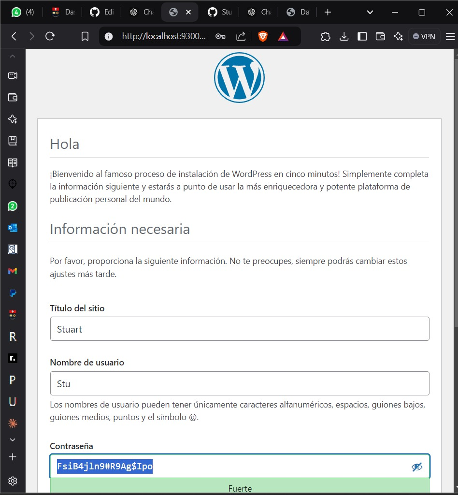

## Esquema para el ejercicio


### Crear la red
````
PS C:\Users\User> docker network create net-wp
8b98a77c0952e6ded80e00c27e8d3f7e35ab63c4ceb75436bc6969f7d4f6e2fd
PS C:\Users\User> docker network ls           
NETWORK ID     NAME          DRIVER    SCOPE
0fa4bb2da5b8   bridge        bridge    local
cd4f98cf18a0   host          host      local
8b98a77c0952   net-wp        bridge    local
7f8c5d5ad0a0   none          null      local
de09df73252d   red           bridge    local
e99987e64024   red2          bridge    local
8eb057478279   redPostgres   bridge    local
PS C:\Users\User> docker
````
# COMPLETAR

### Crear el contenedor mysql a partir de la imagen mysql:8, configurar las variables de entorno necesarias
# COMPLETAR
````
PS C:\Users\User> docker run -d --name mysql-server --network net-wp -e MYSQL_ROOT_PASSWORD=admin -e MYSQL_DATABASE=wordpress -e MYSQL_USER=user -e MYSQL_PASSWORD=123 mysql:8
e3e1e2f1f12bf8bd9ef6596ce3cbab548614b1dfa5115f60d07525c93f2b3455
````
### Crear el contenedor wordpress a partir de la imagen: wordpress, configurar las variables de entorno necesarias
# COMPLETAR
````
PS C:\Users\User> docker run -d --name wordpress --network net-wp -e WORDPRESS_DB_HOST=mysql-server:3306 -e WORDPRESS_DB_USER=wpuser -e WORDPRESS_DB_PASSWORD=wppass123 -e WORDPESS_DB_NAME=wordpress -p 9300:80 wordpress
````

De acuerdo con el trabajo realizado, en la el esquema de ejercicio el puerto a es **(9300)**

Ingresar desde el navegador al wordpress y finalizar la configuración de instalación.
# COLOCAR UNA CAPTURA DE LA CONFIGURACIÓN


Desde el panel de admin: cambiar el tema y crear una nueva publicación.
Ingresar a: http://localhost:9300/ 
recordar que a es el puerto que usó para el mapeo con wordpress
# COLOCAR UNA CAPTURA DEL SITO EN DONDE SEA VISIBLE LA PUBLICACIÓN.


### Eliminar el contenedor wordpress
````
PS C:\Users\User> docker rm -f wordpress
wordpress
````
# COMPLETAR

### Crear nuevamente el contenedor wordpress
Ingresar a: http://localhost:9300/ 
recordar que a es el puerto que usó para el mapeo con wordpress

### ¿Qué ha sucedido, qué puede observar?
# COMPLETAR
````
me aparece una nueva pagina con los detalles de esta pagina y me dice que me registre o logeee
````


